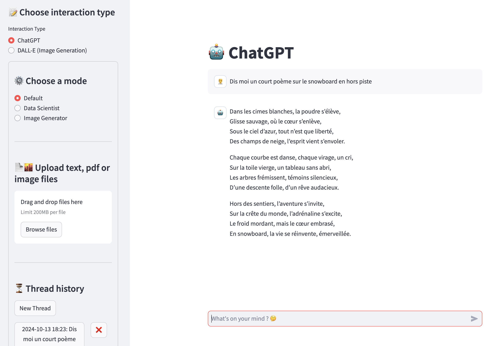

# LLM_webapp

LLM_webapp is a Streamlit application using the OpenAI API to create and manage conversations with a LLM.



## Prerequisites

Before starting, make sure you have installed the following dependencies:

- Python 3.8 or higher
- The libraries listed in `requirements.txt`

## Installation

1. Clone this repository:

    ```bash
    git clone https://github.com/timdgn/LLM_webapp.git
    cd LLM_webapp
    ```

2. Install the dependencies:

    ```bash
    pip install -r requirements.txt
    ```

## Usage

1. Add your OpenAI API key to `.streamlit/secrets.toml`:

    ```toml
    openai_api_key = "YOUR_OPENAI_API_KEY"
    ```

2. Start the Streamlit application:

    ```bash
    streamlit run main.py
    ```

3. Open your browser and go to `http://localhost:8501` to use the app.

## Usage with Docker

You can also build and run the application using Docker. Follow these steps:

1. Build the Docker image:

    ```bash
    docker build -t llm_webapp .
    ```

2. Run the Docker container:

    ```bash
    docker run -d -p 8501:8501 llm_webapp
    ```

   This command maps port `8501` on your local machine to port `8501` in the Docker container and runs the application in the background.

3. Open your browser and go to `http://localhost:8501` to use the app.

## Features

- **File Upload**: You can upload text, pdf files and images to use in conversations.
- **Conversation History**: The app saves and loads previous conversations.
- **Thread Management**: You can create new conversation threads and navigate through existing ones.

## Contributing

Contributions are welcome ! Please submit a pull request or open an issue to discuss any changes you'd like to make.